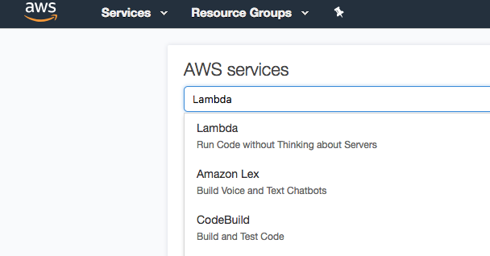
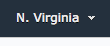
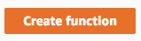
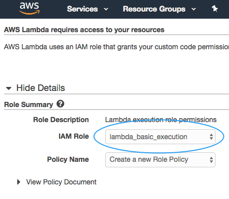
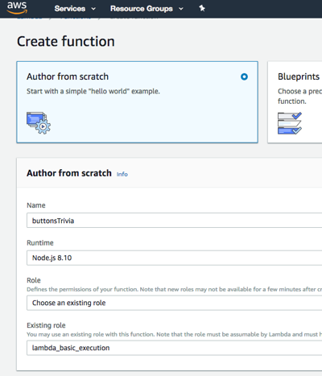
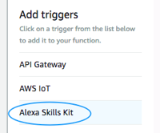
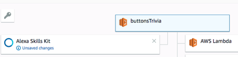
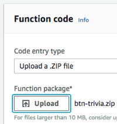
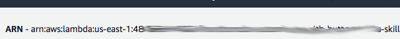
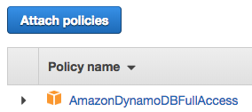

#  Build An Alexa 'Better with Buttons' Trivia Game


[](./1-voice-user-interface.md)[](./2-lambda-function.md)[](./3-connect-vui-to-code.md)[](./4-testing.md)[](./5-customization.md)[](./6-publication.md)

## Prepare the Code for Deployment
1. **Clone** the repository.

	```bash
	$ git clone https://github.com/alexa/skill-sample-nodejs-buttons-trivia/
	```

2. **Install** npm dependencies by navigating into the `/lambda/custom` directory and running the npm command: `npm install`.

	```bash
	$ cd lambda/custom
	$ npm install
	```

3. Create a **zip archive** of the code and dependencies while still in the `/lambda/custom` directory.

	```bash
	$ zip -r ../buttons-trivia.zip .
	```

## Setting Up A Lambda Function Using Amazon Web Services

In the [first step of this guide](./1-voice-user-interface.md), we built the Voice User Interface (VUI) for our Alexa skill.  On this page, we will be creating an AWS Lambda function using [Amazon Web Services](http://aws.amazon.com).  You can [read more about what a Lambda function is](http://aws.amazon.com/lambda), but for the purposes of this guide, what you need to know is that AWS Lambda is where our code lives.  When a user asks Alexa to use our skill, it is our AWS Lambda function that interprets the appropriate interaction, and provides the conversation and button actions back to the user(s).

### Create the Lambda Function

1.  Go to **[AWS](https://aws.amazon.com)** and sign in to the console. If you don't already have an account, you will need to create one.  [If you don't have an AWS account, check out this quick walkthrough for setting it up](https://github.com/alexa/alexa-cookbook/blob/master/guides/aws-security-and-setup/set-up-aws.md).

2.  Click **Services** at the top of the screen, and type "Lambda" in the search box.  You can also find Lambda in the list of services.  It is in the "Compute" section.

    [](https://console.aws.amazon.com/lambda/home)

3.  **Check your AWS region.** AWS Lambda only works with the Alexa Skills Kit in these regions: US East (N. Virginia), US West (Oregon), Asia Pacific (Tokyo)  and EU (Ireland).  Make sure you choose the region closest to your customers.

    

4.  **Click the orange "Create function" button.** It should be near the top of your screen.  (If you don't see this button, it is because you haven't created a Lambda function before.  Click the blue "Get Started" button near the center of your screen.)

    

5.  There are three boxes labeled "Author from scratch", "Blueprints" and "Serverless Application Repository". **Click the radio button in the box titled  "Author From Scratch"**

6. In the "Author from Scratch" section give you funcation a **name**, select **Node.js 8.10** as the **Runtime**, and select **Create a custom role** for the **Role**.

7. A new window or tab will appear, taking you to the creation of a new IAM role. This sets up permissions for execution of your Lambda. In the **IAM Role** selection choose **lambda_basic_execution** and for **Policy** select **Create a new Role Policy**.

   

8. Click the **Allow** button to return to the previous screen.

9. Click the **Create Function** button.

   

10. You are now on the screen that defines your Lambda. Under the **Add Triggers** section on the left select **Alexa Skills Kit** to allow your skill to call this Lambda.

    

11. Under **Configure Triggers**, at the bottom of the page, select **Disable** for **Skill ID Verification**. Next click the **Add** button in the lower right corner.

    **Note:** If you wish to secure this Lambda function in the future there is a guide  [here](https://github.com/alexa/alexa-cookbook/blob/master/guides/aws-security-and-setup/secure-lambda-function.md)

12. Select your Lambda at the top middle of the page (above the boxes for Alexa Skills Kit and Amazon Cloudwatch Logs) and then scroll down the page until you see a section called **Function code**.

    

13. Change the **Code entry type** to **Upload a ZIP** and select the zip you created in the **Prepare the Code for Deployment** section.

    

14. Save the Lambda by clicking the **Save** button in the upper right corner of the screen.

15. You should see the Amazon Resource Name (ARN) a unique identifier for this function in the top right corner of the page. **Copy the ARN value for this Lambda function** for use in the next section of the guide.

    

### Update Lambda Role for DynamoDB Access to Store Player and Game Attributes

1. Click **Services** at the top of the screen, and type "IAM" in the search box, and then press enter.

2. Click **Roles** in the left hand navigation of the IAM Dashboard.

3. Click the role you created above, **lambda_basic_execution**, then click the **Attach Policies** button.

4. In the serch box type "Dynamo" and then select the checkbox next to **AmazonDynamoDBFullAccess**. Click the **Attach Policy** button.

    


[](./3-connect-vui-to-code.md)
