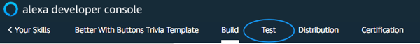
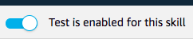
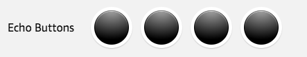
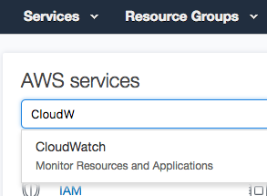
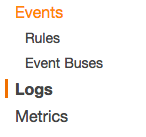

#  Build An Alexa 'Better with Buttons' Trivia Game

## Testing Your Alexa Skill

So far, we have [created a Voice User Interface](./1-voice-user-interface.md), [a Lambda function](./2-lambda-function.md), and [connected the two together](./3-connect-vui-to-code.md).  Your skill is now ready to test.

1.  Go back to the **[Amazon Developer Portal](https://developer.amazon.com/edw/home.html#/skills/list)** and select your skill from the list. You may still have a browser tab open if you started at the beginning of this tutorial.

2. Open the **Test** Pane, by selecting the **Test** link from the top navigation menu.

    

3. Enable Testing by activating the **Test is enabled for this skill** slider. It should be underneath the top navigation menu.

    

4. To validate that your skill is working as expected, invoke your skill from the **Alexa Simulator**. You can either type or click and hold the mic from the input box to use your voice.
	1. **Type** "Open" followed by the invocation name you gave your skill in [Step 1](./1-voice-user-interface.md). For example, "Open Buttons Trivia".
	2. **Use your voice** by clicking and holding the mic on the side panel and saying "Open" followed by the invocation name you gave your skill.
	3. **If you've forgotten the invocation name** for your skill, revisit the **Build** panel on the top navigation menu and select Invocation from the sidebar to review it.

5. Use the virtual Echo Buttons in the simulator to play your game.

    

6. Ensure your skill works the way that you designed it to.
   * After you interact with the Alexa Simulator, you should see the Skill I/O **JSON Input** and **JSON Output** boxes get populated with JSON data. You can also view the **Device Log** to trace your steps.
	* If it's not working as expected, you can dig into the JSON to see exactly what Alexa is sending and receiving from the endpoint. If something is broken, viewing the log output produced by your Lambda code offers additional insight.

7. **Viewing Lambda Logs in Cloud Watch**.
   * Go back to **[AWS](https://aws.amazon.com)** and sign in to the console.
   * Click **Services** at the top of the screen, and type "CloudWatch" in the search box.  You can also find Lambda in the list of services.  It is in the "Management Tools" section.

     

   * Select **Logs** from the left side menu.

      

   * Select the log group with the name matching the name you gave your Lambda function. You will now be presented with a list of logs by date that you can view for more insight on what is happening with the code.

8. **Other testing methods to consider:**

    * [Virtual Alexa](https://github.com/bespoken/virtual-alexa) from [Bespoken.io](https://bespoken.io/) - provides a mechanism to easily test Alexa skills programatically.
    *  [Echosim.io](https://echosim.io) - a browser-based Alexa skill testing tool that makes it easy to test your skills without carrying a physical device everywhere you go.

9.  If your sample skill is working properly, you can now customize your skill.

