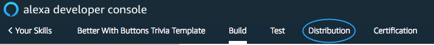
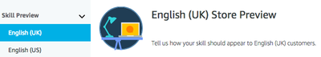
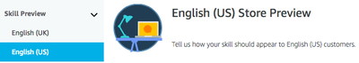
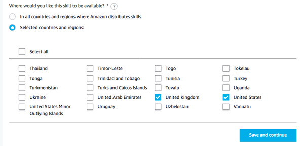

#  Build An Alexa 'Better with Buttons' Trivia Game


[](./1-voice-user-interface.md)[](./2-lambda-function.md)[](./3-connect-vui-to-code.md)[](./4-testing.md)[](./5-customization.md)[](./6-publication.md)
## Get Your Skill Certified and Published

We are almost done!  The last step is to add the metadata that your skill will use in the [Skill Store](http://amazon.com/skills).  This page will walk you through the remaining steps to launch your skill!

### Distribution



1. Select the **Distribution** link  from the top navigation menu.

#### NOTE

You will fill out all of the fields in the **Distribution** section for every locale you have created a language model for. We recommend submitting to the US and UK at a minimum. In this example we have created models for both and will need to fill out these questions for each.





2. Fill out the form fields per the guidance on the screen. Hover over the question mark icons for details regarding each respective field. **Fields marked with an Asterisk, are required!**
	* Take the time to get these right so that your skill will pass certification!

3.  Write your skill descriptions.

       *  **Spend some time coming up with an enticing, succinct description.**  This is one of the few places you have an opportunity to attract new users, so make the most of it!  These descriptions show up in the list of skills available in the [Alexa app](http://alexa.amazon.com/spa/index.html#skills) and the [skills store](http://www.amazon.com/skills).

4.  For your example phrases, **come up with the three most exciting ways** a user can talk to your skill.

    *  Make sure that each of your example phrases are a **perfect match with one of your Sample Utterances.**  Incorrect example phrases are one of the most common reasons that skills fail certification, so we have provided a short list of things to consider as you write your example phrases:

       | Common Failure Points for Example Phrases |
       | ----------------------------------------- |
       | Example phrases **must** adhere to the [supported phrases](https://developer.amazon.com/public/solutions/alexa/alexa-skills-kit/docs/supported-phrases-to-begin-a-conversation). |
       | Example phrases **must** be based on sample utterances specified in your Intent Schema. |
       | Your first example phrase **must** include a wake word and your invocation name. |
       | Example phrases **must** provide a contextual response. |

    *  **Choose three example phrases that are likely to be the most common ways that users will attempt to interact with your skill.**  Make sure that each of them works well, and provides an excellent user experience.

5.  **Create your skill's icons.**  You need two sizes of your icon: 108x108px and 512x512px.


    *  **Make sure you have the rights to the icons you create.** Please don't violate any trademarks or copyrights.
    *  **If you don't have software to make icons, try one of these free options:**

       *  [GIMP](https://www.gimp.org/) (Windows/Mac/Linux)
       *  [Canva](https://www.canva.com/) (Web)
       *  [Paint.NET](http://www.getpaint.net/index.html) (Windows)
       *  [Inkscape](http://inkscape.org) (Windows/Mac/Linux)
       *  [Iconion](http://iconion.com/) (Windows/Mac)

6. Choose the most appropriate category for your skill.

7.  **Provide a comprehensive list of keywords for users that are searching for new skills.**  This is an optional field, and searching the [Alexa app](http://alexa.amazon.com) or the [skill store](http://www.amazon.com/skills) will also find the words in your Skill Name and descriptions, so you don't need to overdo it.  That being said, if there are words that you want users to find your skill with, you should include them here.  Separate the keywords with commas.

8. **Privacy Policy URL.** This is an optional field, and should not be required for this Trivia skill sample.  You can leave it blank.

9. **Terms of Use URL.** This is also optional, and you can leave it blank.

10. When you're ready, click **Save and Continue** at the bottom of the screen to move onto the **Privacy & Compliance** section.

### Privacy and Compliance

1. **Does this skill allow users to make purchases or spend real money?** For this trivia skill, the answer is no.  For future skills, make sure you answer this appropriately.

2. **Does this Alexa skill collect users' personal information?** Again, for this trivia skill, the answer is no.  If you do collect information about a user, such as names, email addresses, phone numbers, and so forth, ensure that you answer Yes to this question.
    *  Answering "yes" to this question will also require you to provide a link to your Privacy Policy at the bottom of the page.

3. **Is your skill directed to children under the age of 13?** Because you customized this skill with data you provided, it is possible that you created a skill that targets children under the age of 13.  For this trivia skill, the answer is **no** because it doesn't target a specific age group.
    * Factors to consider in determining if this skill is directed to children under 13 include:
        * Subject matter of the skill
        * Presence of child-oriented activities and incentives
        * Type of language used in the skill
        * Music and other audio content in the skill
        * How the skill is described and marketed
        * Intended audience for the skill

        If you're not sure, please see the [FTC's COPPA Guidance and FAQ](https://www.ftc.gov/tips-advice/business-center/guidance/complying-coppa-frequently-asked-questions) for more information.

4.  **Export Compliance.** Be certain that you agree with all of the conditions.  If you do, make sure to check this box, as Amazon requires this permission to distribute your skill around the globe.

5. **Provide testing instructions.** Testing instructions give you an opportunity to explain your skill, and any special or possibly confusing features, to the certification team.  A value is required in this box.

	* Since you are using our Sample, make sure to add a sentence to your Testing Instructions referencing the Sample you used. For example:

           ```
           This was built using the Buttons Trivia Sample.
           ```

           This will let the testing team understand what you're providing them, and should decrease the testing time required.

	**Note:** More details on certification are [available here.](https://alexa.design/certification)

6. When you're ready, click **Save and Continue** at the bottom of the screen to move onto **Availability**.

### Availability

1. Here you can select to make this skill available to the public or just your business. You can also set up a beta test for you skill. More information is available at [Beta Testing for Alexa Skills](https://developer.amazon.com/docs/custom-skills/skills-beta-testing-for-alexa-skills.html).

2. Select the regions to make your game available to. In this example we language models for both the UK and the US so we will select those countries.



3. Click the **Save and Continue** button at the bottom of the page to move to the final step before submitting your game for certification.

### Certification


1. On the final page of this flow you will run some validation and functional tests. Correct any errors that are reported back to you. These will generally report back issues dealing the the values you've previously entered or glaring problems with the skill such as bad certificates or missing endpoints. When they both pass click **Submit** to sumbmit your game for certification.

2. **You're done with your submission!**  Here are a few things you might need to know:

    *  **Certification can take several days to complete.** Please be patient.  It takes time because we want to get it right.

    *  **Did something go wrong?** Our team of evangelists run [online office hours every Tuesday from 1-2pm Pacific Time on Twitch](https://www.twitch.tv/amazonalexa).  They can help answer any questions you might have.

    *  **Want the coolest t-shirt you've ever seen?** Every month, we create a brand-new Alexa Developer t-shirt or hoodie, and send them out to developers that published a skill that month.  [You can get yours here if you live in the US](https://developer.amazon.com/alexa-skills-kit/alexa-developer-skill-promotion), [here for the UK](https://developer.amazon.com/en-gb/alexa-skills-kit/alexa-developer-skill-promotion), and [here for Germany](https://developer.amazon.com/de-de/alexa-skills-kit/alexa-developer-skill-promotion).
